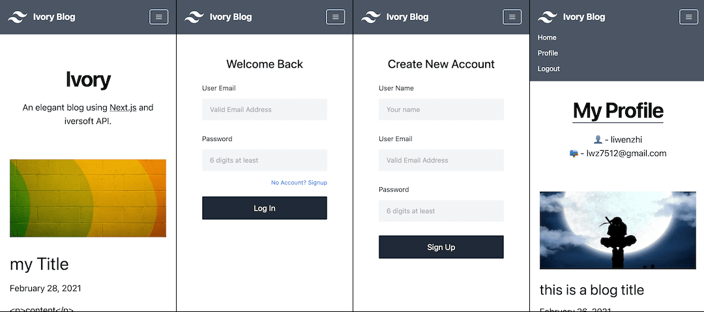

# Ivory blog based on Next.js and iversoft API 

This repository(Ivory Blog) is for the demonstration of coding test requested by iversoft.

Based on [Next.js blog-starter](https://github.com/vercel/next.js/tree/canary/examples/blog-starter)

## Screenshots



## Demo

- [Ivory blog](https://next-ivory-blog.vercel.app)
- [Original demo from vercel official](https://next-blog-starter.vercel.app/)

## Features

- Signin/Signup page with the iversoft API.
- Profile page displaying user info and his/her posts.
- Logout to initial status.
- User login session keeping until expiry.
- [Cover image](./components/cover-image.js) progressive loading optimization thanks to hacked `next/image` for better user experience.
- Responsive layout.
- Fancy user interaction widgets.
- Add Jest test cases.

## Deploy your own

- clone this repository
- create an environment config file `.env.local` like .env.example under repo root directory
- add your iversoft API KEY after `API_KEY=` in your newly created `.env.local`
- install dependencies by `yarn` command
- start dev server by `yarn dev` command

These steps can be done by following commmands:(assume you are using Mac)

```
% cd your/dev-projects/path
% git clone https://github.com/lwz7512/next-ivory-blog.git
% cd next-ivory-blog
% cp .env.example .env.local
```

> now copy and paste your API KEY to .env.local after `API_KEY=` field, then:

```
% yarn
% yarn dev
```

open browser to visit: http://localhost:3000


## Test

Start a new console window, enter into `next-ivory-blog` direction, then run:

```
% yarn test
```

the tests/index.test.js will check 3000 port exist, then start testing or failed.

## Design decisions

Some key factors considered in choosing React.js tech solutions(CRA, Gatsbyjs, Nextjs):

- Fast to get started
- API first architecture
- Rich starters/themes to choose
- Elegant design out there
- Use Tailwind CSS as styling approach

I've used CRA, Gatsbyjs for couples of projects, deeply understand the two solutions can not meet all of requirements. So, Nextjs was choosen. 

## Unforeseen issues encountered

- cors request error from localhost, ending up call iversoft API in backend.
- next/image does not support progressive display, so did some hack works by adding a thumb image and detect load complete.
- detect local service port(3000) in beforeAll test, stop all test if not in use(service unavailable)

## Endeavors worth mention

- User experience consideration for adding cover image progressively loading that doesn't exist in original `next/image` component(without this, page would display white blank area)
- Added remote data fetching in case of single blog page refresh manually
- Added service availability check before test running

## Items incomplete or to be improved

- User info update.
- Add signin/signup page test cases.
- Add running environment detection(browser or node) to avoid page component rendering exception while running test caused by browser `fetch` API.
- Add form inputs strict validation, like length, format, currently no length limits regretfully.
- Pagination for posts
- and more...

## Credits

thanks to the following third party libraries:

- tailwindcss
- react-icons
- react-spinners
- react-toastify
- node-fetch
- form-data
